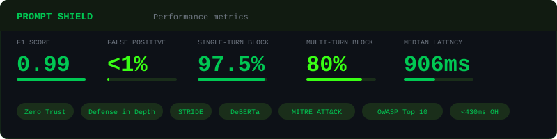
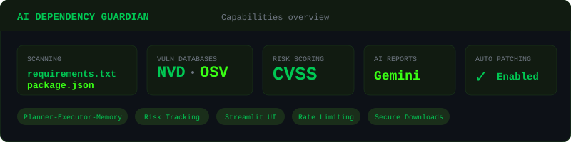

<!-- Header Banner -->
<p align="center">
  
</p>

<!-- Typing SVG -->
<p align="center">
  <a href="https://git.io/typing-svg">
    
  </a>
</p>

<!-- Profile Views & Social Badges -->
<p align="center">
  <a href="https://www.linkedin.com/in/dhwanitpandya"></a>
  <a href="mailto:pandyadhwanit25@gmail.com?hl=en"></a>
  <a href="mailto:pandyadhwanit25@gmail.com?hl=en"></a>
</p>

---

## 🧑‍💻 About Me

```yaml
name: Dhwanit Samir Pandya
location: Bloomington, IN
current_role: Cybersecurity Research Fellow @ CACR, Indiana University
previous_role: Cybersecurity Analyst, Technology Consulting @ Ernst & Young (EY)
education: MS Computer Science @ Indiana University Bloomington (GPA 3.93/4)

focus_areas:
  - AI Security & Adversarial ML
  - Prompt Injection Defense Systems
  - Shift-Left Security & Secure SDLC
  - Cloud Security & DevSecOps

fun_fact: "Solved 80% of CTF challenges at BSides 2024 🚩"
```

---

## 🏅 Certifications

<p align="center">
  
  
  
  
  
</p>

---

## ⚒️ Tech Arsenal

<table align="center">
<tr>
<td align="center" width="50%">

**🔐 Security & Offensive**

<p align="center">
  
  <br/>
  
  
  
  
  
</p>

</td>
<td align="center" width="50%">

**☁️ Cloud & DevOps**

<p align="center">
  
  <br/>
  
  
</p>

</td>
</tr>
<tr>
<td align="center" width="50%">

**💻 Languages & Scripting**

<p align="center">
  
</p>

</td>
<td align="center" width="50%">

**🌐 Web & Databases**

<p align="center">
  
</p>

</td>
</tr>
</table>

<details>
<summary><b>📋 Security Frameworks & Standards (click to expand)</b></summary>
<br/>
<p align="center">
  
  
  
  
  
  
  
  
  
</p>
</details>

---

🚀 Featured Projects
🛡️ Prompt Shield — Context-Aware Prompt Injection Defense for LLM Chatbots
<!-- Place assets/prompt-shield-metrics.svg in your repo -->
<p align="center">
  
</p>
<p align="center">


</p>

🔍 AI Dependency Guardian — Open-Source SCA Scanner with AI-Powered Risk Reports
<!-- Place assets/dependency-guardian-metrics.svg in your repo -->
<p align="center">
  
</p>
<p align="center">


</p>

---

---

## 📊 GitHub Stats

<!-- Streak Stats -->
<p align="center">
  
</p>

<!-- GitHub Stats & Top Languages -->
<!-- Using github-readme-stats-fast as the original vercel instance is paused -->
<!-- If these break too, deploy your own: https://github.com/anuraghazra/github-readme-stats#deploy-on-your-own -->
<p align="center">
  
  &nbsp;
  
</p>

---

## 🏆 Extracurriculars & CTFs

<p align="center">
  
  
  
  
  
</p>

---

## 🌱 Currently Exploring

<p align="center">
  
  
  
  
</p>

---

## 🤝 Open to Collaboration

<p align="center">
  <i>If your project touches <b>AI security</b>, <b>prompt injection defense</b>, <b>DevSecOps</b>, or <b>open-source security tooling</b> — let's talk.</i>
</p>

<p align="center">
  <a href="https://www.linkedin.com/in/dhwanitpandya">
    
  </a>
  &nbsp;
  <a href="mailto:pandyadhwanit25@gmail.com">
    
  </a>
</p>

---

<!-- Snake Animation - requires GitHub Action setup, see: https://github.com/Platane/snk -->
<!--
<p align="center">
  
</p>
-->

<!-- Activity Graph -->
<p align="center">
  
</p>

<!-- Footer -->
<p align="center">
  
</p>

### **Contact** 
<a href="https://www.linkedin.com/in/dhwanitpandya"></a>
<a href="mailto:pandyadhwanit25@gmail.com?hl=en"></a> 


I have completed several projects throughout my courses and you can check them out right below.

